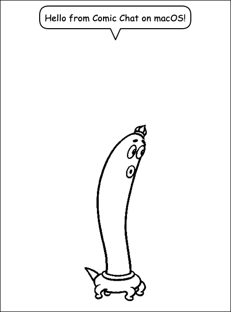
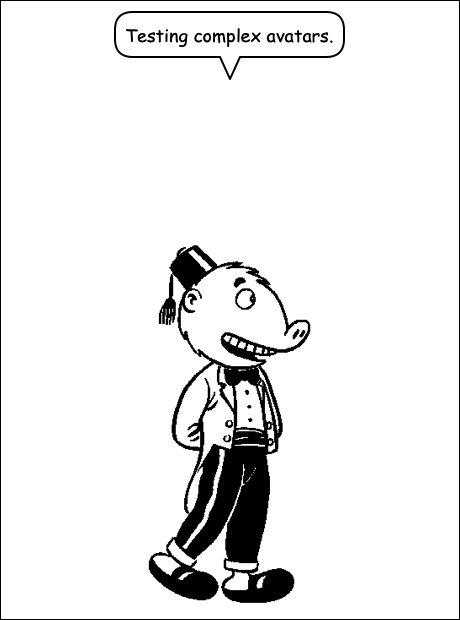

# Comic Chat — native macOS MVP (comic-only)

A small, working proof of concept: a **native Cocoa app** that renders a Microsoft
Comic Chat comic panel from an original 1996 character (`.avb` art) plus a line
you type — no IRC, no networking. It's the first milestone of the native macOS
port described in `docs/superpowers/specs/2026-07-17-macos-comic-only-port-*.md`.



## What works

- Loads all 22 original characters from `v1.0-pre-modern/comicart/avatars/` —
  both `AT_SIMPLE` single-part avatars (connor, glenda, jordan, pedagog,
  rainbow, tux, waf) and `AT_COMPLEX` head + torso avatars.
- Decodes the 1-bit / 4-bit / 8-bit Windows DIBs embedded in `.avb` (incl. RLE8),
  palette → RGBA, entirely in portable C++.
- Composites `AT_COMPLEX` bodies from a 1-bit mask silhouette: head over torso,
  drawn in the avatar's `TORSOFIRST` flag order, deriving per-pixel alpha from
  the mask so the parts stack cleanly.
- Composes one panel — framed background, a speech balloon with a tail and
  CoreText word-wrapping, and the character beneath it.
- Renders through an abstract `IComicRenderer` seam implemented over
  CoreGraphics + Core Text (Objective-C++).

### Complex characters

`AT_COMPLEX` avatars are built from separate head and torso art unified by
`composeNeutralBody()`, which treats the single-part `AT_SIMPLE` case as a
degenerate one-part composition. Below is the complex character `mike`:



## Architecture

The design's core/UI split, in miniature:

```
libcomic/   portable C++, no OS deps
  comic_types.h      Point/Rect/RGBA/Size (portable POINT/RECT/COLORREF)
  comic_dib.*        Windows DIB decoder (1/4/8bpp + RLE8) -> RGBA
  comic_avatar.*     AT_SIMPLE .avb loader (ported from avatario.cpp)
  comic_renderer.h   IComicRenderer — the abstract draw seam
  comic_panel.*      minimal panel + balloon layout (word-wrap via measureText)
  png_writer.*       test-only PNG output (zlib)
mac/        Objective-C++ / Cocoa
  CoreGraphicsRenderer.*  IComicRenderer over CGContext + Core Text
  main.mm                 AppKit window: character picker + say box + ComicView
  render_panel.mm         headless render of the same seam (for verification)
```

## Build & run

```sh
cd v1.0-pre-mac
make app        # build ComicChatMac.app
make run        # launch it
```

Other targets:

```sh
make test_art       # headless: decode a pose to PNG (no Cocoa)
make render_panel   # headless: render a full panel to PNG via the real seam
./build/render_panel ../v1.0-pre-modern/comicart/avatars connor "Hi!" out.png
```

## Scope / what's deliberately deferred

This is an MVP spike, not the finished port. Intentionally not done yet:

- **Aura / nimbus glow**: the 1-bit masks are now composited, but the
  aura/nimbus layer around a character is not yet drawn.
- **Text → emotion/gesture** analysis: the app always uses the neutral pose.
- **Multi-panel pages**, history, save/load, printing.
- The ornate `CBWoodring` balloon spline shapes (we use a simple rounded balloon).

See the port design + source-map docs for the full plan and the ordered risk list.
